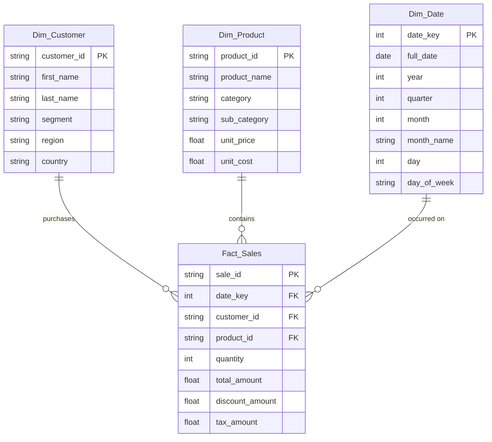

# Architecture & Data Modeling

This document outlines the Star-Schema Dimensional Data Model driving ExecPulse-BI.

## Core Philosophy
We isolate the heavy data transformations upstream (via Python/Pandas pipeline) rather than embedding complex, row-level calculations inside the BI visualization engine. This ensures our BI platform (Power BI / Tableau) remains highly performant, simply querying aggregated views.

## Star Schema Entity-Relationship Diagram (ERD)

The dimensional model enforces strict 1-to-Many relationships from the Dimension tables to the Fact table.

## Data Flow
1. **Raw Mock Generation:** Synthetic e-commerce transactional data is generated by `notebooks/data_pipeline.ipynb`.
2. **Pandas Transformation:** Data is cleaned, validated, and split into dimension and fact structures.
3. **Storage:** Output is pushed to `data/processed/` as both CSVs and a normalized SQLite database.
4. **BI Consumption:** The resulting tables are mapped in Power BI/Tableau, where Dynamic DAX/LOD measures are layered on top for interactive KPI dashboarding.

### Sibling Files
*(No sibling architecture files at this level. All architectural specs are summarized here.)*